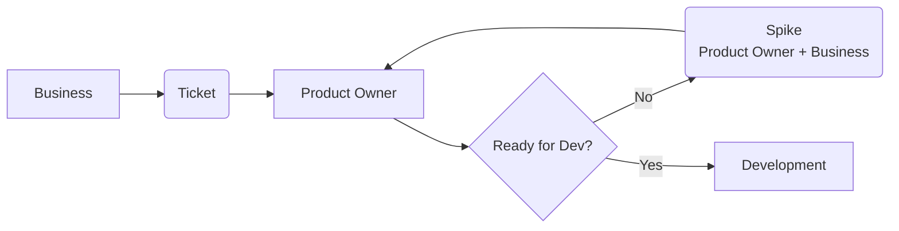
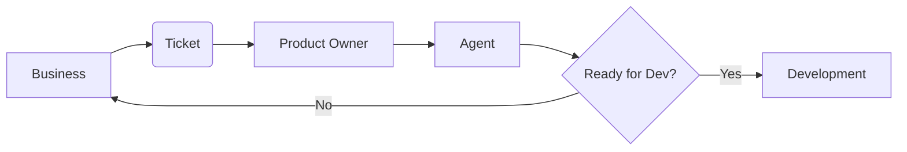

## Functional Layer

### Before 

```mermaid
flowchart LR

A[Business] --> B(Ticket) --> C[Product Owner]
C --> D{Ready for Dev?}
D -->|No| E(Spike<br/>Product Owner + Business) --> C
D -->|Yes| F[Development]
```

### After

```mermaid
flowchart LR

A[Business] --> B(Ticket) --> C[Product Owner] --> D[Agent]
D --> E{Ready for Dev?}
E -->|No| A
E -->|Yes| F[Development]
```
